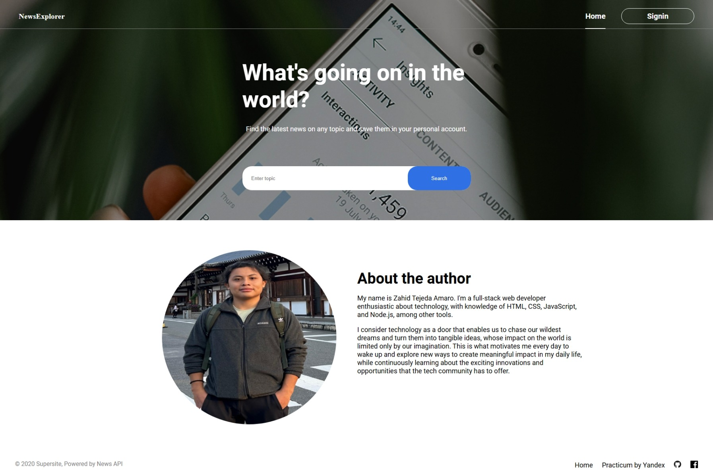
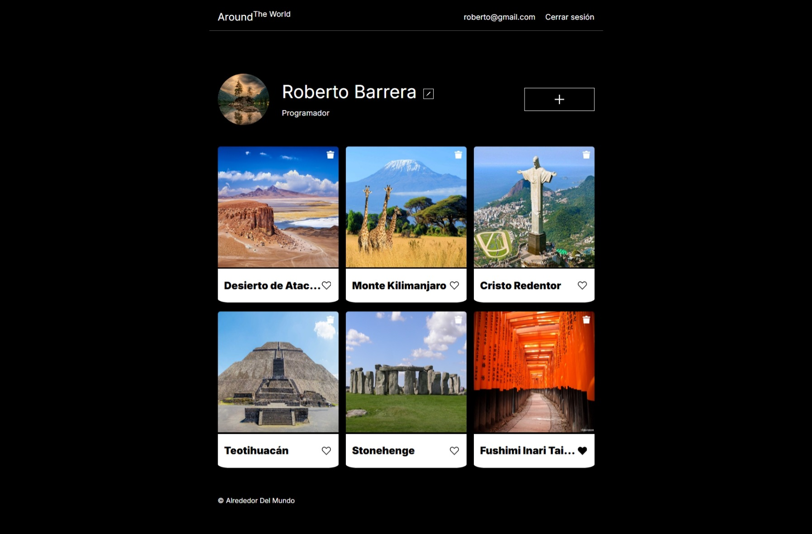

  

  

  

  

  

  

<h2>My Projects</h2>

<table align="center">
  <tr>
    <td align="center" width="50%" valign="top">
      <h3>News Explorer App</h3>
      
      
      
      

        News Explorer App is a news search application that provides access to a wide variety of news sources and information channels.
      

    </td>
    <td align="center" width="50%" valign="top">
      <h3>Around the World App</h3>
      
      
      
      

        Interactive social media-style platform that allows users to share and discover places around the world.
      

    </td>
  </tr>
</table>
